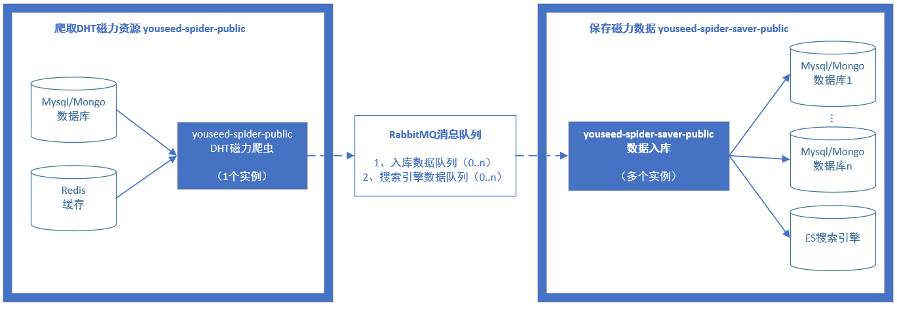

# Youseed磁力爬虫 #

此程序使用python语言，在目前最流行的磁力爬虫`sim_dht_spider.py`基础之上改写而来，具有更低的资源占用和更高的爬取性能。

如果使用HDD硬盘的服务器，例如KS3C之流，本爬虫可以大幅提高抓取效率。

注意：此程序是上图左侧方框“爬取DHT磁力资源”的部分。

- DHT爬虫：[https://github.com/dht-open/youseed-spider-public](https://github.com/DHT-open/youseed-spider-public)
- 爬虫数据入库：[https://github.com/DHT-open/youseed-spider-saver-public](https://github.com/DHT-open/youseed-spider-saver-public)

*此程序仅用作技术学习和研究*

# 功能 #

抓取磁力元数据，并保存到消息队列。

**注意**：此爬虫程序主要负责抓取数据，需要配合“youseed-spider-saver-public”程序保存至数据库。

- 使用“纸上烤鱼”磁力程序，运行`dht_spider_zsky.py`＋`youseed-spider-saver-public.jar`爬取和保存资源;
- 使用“Youseed”磁力程序，运行`dht_spider.py`＋`youseed-spider-saver-public.jar`爬取和保存资源;

# 程序特点 #

1. 多级缓存：使用python内存、redis缓存存储一段时间内的有效/无效资源信息，大幅减少了数据库检索次数，提高了抓取效率；
2. 异步存储：使用消息队列解耦了读写环节，提高了抓取效率；
3. 多站点支持：支持一个爬虫抓取数据，异步保存到多个数据库；
3. 实时索引：增加了对搜索引擎的支持，可以将抓取到的数据即时更新到实时搜索引擎；
4. 逻辑优化：
	- 大幅提高了失败资源的重新抓取频率（实验性改进）；
	- 降低了旧资源入库比例，并支持自行调整；

# 硬件要求 #

- 内存：1G以上。爬虫的爬取速度越快，内存占用越高，所以内存越大越好，要避免redis进入swap，造成性能下降
- CPU：1G以上。爬取速度越快，CPU占用越高。从经验上来说，需要Atom以上级别的CPU
- 网络：默认需开放8004和6881端口：TCP和UDP协议

# 软件要求 #

需要安装以下软件：

- python
- redis
- rabbitMQ
- Mongodb（Youseed磁力程序）/ Mysql（纸上烤鱼磁力程序）